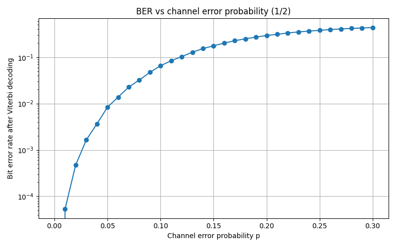
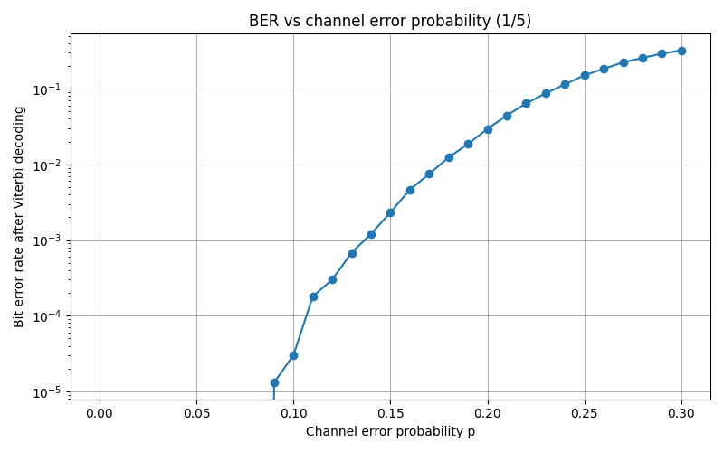
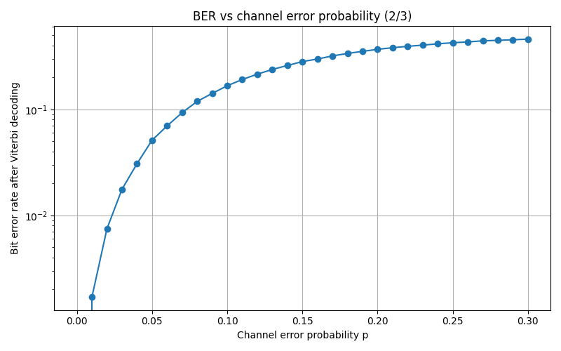
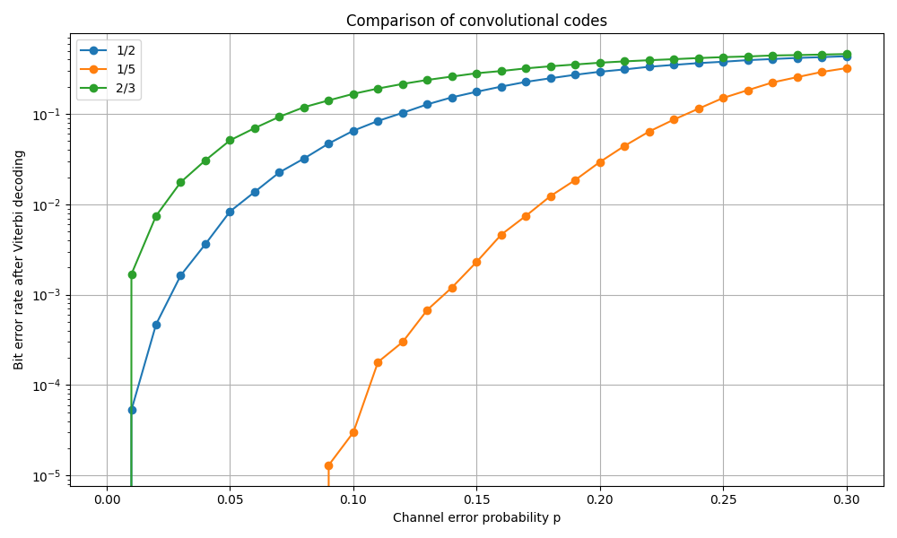

# Viterbi Decoder 

Данный проект представляет собой систему помехоустойчивого кодирования, включающую реализацию свёрточных кодов и алгоритма Витерби на C++. Проект позволяет моделировать передачу данных через канал с шумом и анализировать вероятность ошибки (BER). 

## Основные возможности

* 
**Гибкая настройка кодов:** поддержка произвольного количества входных/выходных битов и глубины памяти. 


* 
**Эффективное декодирование:** алгоритм Витерби с использованием таблиц переходов (LUT) для высокой производительности. 


* 
**Симуляция канала:** модель двоичного симметричного канала (BSC). 


* 
**Анализ данных:** проведение испытаний методом Монте-Карло с выводом результатов в CSV. 


## Архитектура проекта

Проект организован в виде нескольких модулей: 

* 
`ConvolutionalCode`: логика свёрточного кодирования и управление состояниями. 


* 
`ViterbiDecoder`: реализация поиска наиболее вероятного пути в решетке. 


* 
`BscChannel`: моделирование среды передачи с внесением ошибок. 


* 
`SymbolCodec`: упаковка и распаковка битовых векторов. 


## Использование

### Сборка проекта

Для сборки используется **CMake**. Убедитесь, что ваши исходные файлы находятся в папке `src`, а заголовочные файлы — в `include`.

```bash
# Создание директории для сборки
mkdir build && cd build

# Конфигурация
cmake ..

# Сборка
cmake --build .

```

### Запуск

После успешной сборки запустите исполняемый файл:

```bash
# Для Linux/macOS
./viterbi_app

# Для Windows (CMD/PowerShell)
./viterbi_app.exe

```

После выполнения в папке `build` появится файл `ber_results.csv`. 

### 3. Визуализация результатов (Python)

Для построения графиков используйте прилагаемый Python-скрипт. Он создаст отдельные графики для каждого кода и одно общее сравнение в логарифмическом масштабе.

**Зависимости:** `pandas`, `matplotlib`.

```bash
python plot_results.py

```

## Результаты

Скрипт генерирует следующие файлы:

* `ber_comparison.png`: итоговый график сравнения эффективности различных свёрточных кодов.
* `ber_{code}.png`: детальные графики для каждой конфигурации.

Графики строятся в логарифмической шкале по оси Y, что позволяет наглядно оценить "gain" (выигрыш) кодирования при низких значениях вероятности ошибки.


### Код 1/2

<p align="center">
  
</p>

---

### Код 1/5

<p align="center">
  
</p>

---

### Код 2/3

<p align="center">
  
</p>

---

### Сравнение кодов

<p align="center">
  
</p>
